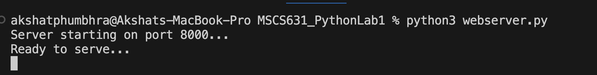
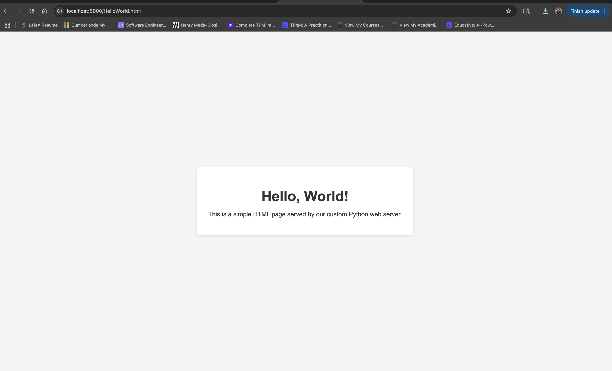

# Lab 1: Simple Python Web Server

### Oishani Ganguly

## Reflection on the Lab Experience

Working through this lab was my first hands-on dive into low-level socket programming in Python, and it really drove home how much goes on “under the hood” of a simple web request. Parsing the raw HTTP header, binding to a port, and manually sending byte-streams of the file content gave me a much deeper appreciation for frameworks like Flask or Django, which abstract all of these details away. Watching the TCP handshake happen in real time, complete with STATUS lines and carriage-return/linefeed delimiters, was exciting! By the end, I felt much more confident in how HTTP messages are structured and how a server routes incoming requests to the file system.

## Challenges Encountered

One of the trickier parts was correctly decoding and splitting the incoming request to extract the filename. If we don’t decode the bytes or handle leading slashes properly, Python will look for a file that doesn’t exist. I also had to pay very close attention to socket management: forgetting to close the client socket in the error path led to silent hangs in the browser, and missing the blank line after the headers (`\r\n\r\n`) caused browsers to buffer indefinitely. Constructing the exact HTTP response header formatting was finicky and required careful testing to get right.

## Screenshots

### 1. Logs from the running webserver

*Terminal showing logs of the webserver ready to serve content*

---

### 2. Successful Page Load  
  
*Browser displaying `HelloWorld.html` served by `webserver.py` at `http://localhost:8000/HelloWorld.html`*

---

### 3. 404 Not Found Error  
  
*Browser displaying the custom 404 page when requesting a non-existent file at `http://localhost:8000/NotAFile.html`*

